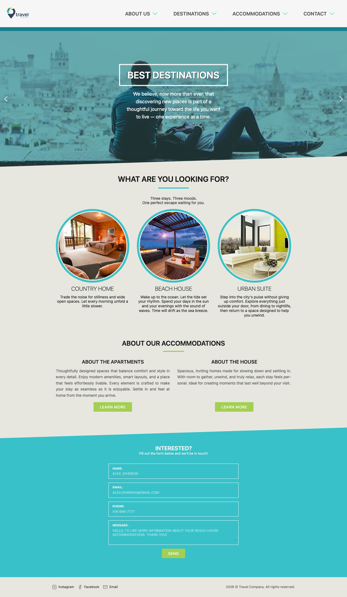

# travel
A fully responsive Front-End example, contains only an index page based on a designed image.

HTML + Pure CSS + Javascript

Unit tests with Vitest.



Using Playwright for screenshots of multiple devices (see [tests/screenshots](tests/screenshots)).

To update the screenshots:
```
yarn screenshot --update-snapshots
```
